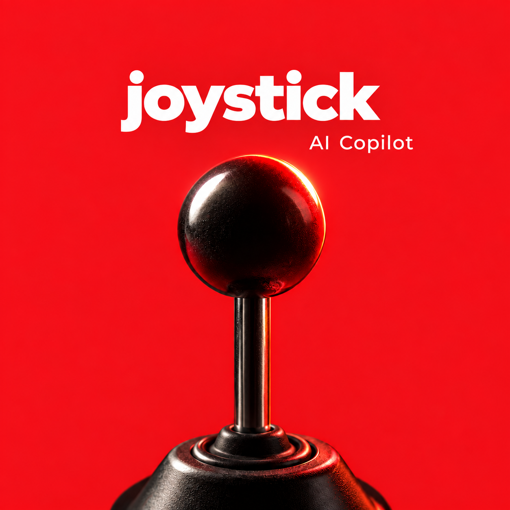
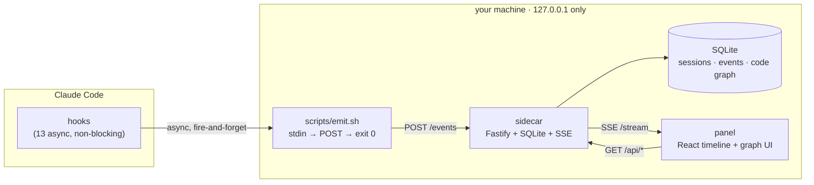

<p align="center">
  
</p>

<h1 align="center">joystick</h1>

<p align="center"><strong>A local, live control panel for your Claude Code sessions.</strong></p>

joystick turns a Claude Code session into a readable, narrated timeline and a live map of your
codebase — running entirely on your machine, in a browser tab, with zero tokens spent watching you
work.


---

## Why

Claude Code's own TUI shows you one step at a time, in real time, and then it's gone. joystick
listens on the side and gives you a second screen: a scrollable, grouped, plain-language record of
what happened in a session — every tool call, every subagent, every turn — plus a live import graph
of the repo it's working in.

- **No AI in the hot path.** Every summary is a pure function of fields the hook payload already
  contains — no `prompt` or `agent` hooks, no model calls, no added latency on the agent loop.
- **Never blocks Claude Code.** Hooks fire `async`; a dead or slow sidecar costs nothing to the
  session it's watching.
- **Local only.** The sidecar binds `127.0.0.1`. Nothing about your session ever leaves the machine.
- **Untrusted by design.** Payloads are stored as text and rendered as text — never evaluated, never
  shell-interpolated, never dropped into HTML.

## What it shows you

| | |
| --- | --- |
| **Narrated timeline** | Every step in the session as one deterministic line — tool, target, status — grouped by turn, with subagent work nested under the call that spawned it. Diffs, full output, and Claude's own stated reasoning (when the transcript has it) are one click away. |
| **Live import graph** | A force-directed map of your repo's file-level imports, built from static extraction. Collapses to directories, expands on click, highlights a file's direct neighbors. Refreshes automatically as you edit. |
| **Session chat** | Ask a question about "what changed and why" and get an answer grounded in the session's own recent activity — via your choice of local or hosted model backend. |
| **Replay** | Feed any captured session back through the exact same rendering path used live, for demos or debugging without needing a running session. |

## Architecture



A `command` hook fires on every Claude Code lifecycle event, pipes the payload through a five-line
POSIX shim into the sidecar, and returns immediately — the shim always exits `0`, so a refused
connection costs exactly as much as a successful one. The sidecar persists everything to SQLite and
pushes updates to the panel over SSE. Nothing here calls a model.

## Quickstart

```bash
pnpm install
pnpm --filter @joystick/panel build     # panel is served by the sidecar from dist/
pnpm start                              # sidecar on http://127.0.0.1:8787

claude plugin marketplace add "$PWD"
claude plugin install joystick@joystick-dev --scope user --config port=8787
```

Open `http://127.0.0.1:8787` and start (or resume) any Claude Code session — steps appear live.

Develop with hot reload, without needing a live session:

```bash
pnpm dev                    # sidecar + Vite, panel on :5173 proxying to :8787
pnpm replay                 # replay fixtures/sample-session.jsonl
pnpm replay fixtures/parallel-subagents.jsonl --fresh --speed 4
```

## Layout

```
.claude-plugin/plugin.json       manifest + userConfig.port
.claude-plugin/marketplace.json  local dev marketplace
hooks/hooks.json                 13 async command hooks
scripts/emit.sh                  the shim: stdin → POST → exit 0, always
scripts/replay.ts                feed a JSONL fixture into a running sidecar
scripts/bench.ts                 wall-clock A/B harness
packages/shared/                 zod schemas, summaries, subagent attribution
packages/sidecar/                Fastify + better-sqlite3 + SSE
packages/panel/                  React + Vite
fixtures/                        sample-session.jsonl, parallel-subagents.jsonl (real captures)
```

## Endpoints

| Route | Purpose |
| --- | --- |
| `POST /events` | Ingest. Validates the envelope, writes, returns 204. Broadcast happens after the response. |
| `GET /health` | Liveness, port, db path, subscriber count. |
| `GET /stream` | SSE feed of new events. |
| `GET /api/events?limit&session_id` | Backfill, newest first. |
| `GET /api/sessions` | Known sessions with event counts. |
| `GET /api/codegraph` | The current import graph (nodes, edges, extraction metadata). |

## Storage

SQLite under `${CLAUDE_PLUGIN_DATA}` (`~/.claude/plugins/data/joystick/joystick.db`), WAL mode.
Every event stores the raw payload verbatim alongside extracted columns, so a payload shape the
schema doesn't recognize yet is still kept — marked `known = 0` — rather than dropped.

## Known gaps

- **`SessionEnd` is not guaranteed** to fire on every session — the panel treats an unterminated
  session as normal rather than an error state.
- **Subagent parent attribution is inferred**, not given by Claude Code, via spawn-order adjacency.
  Isolated to one function, tested against real captures.
- **Most steps have no stated reasoning** — Claude Code's transcript only carries prose ahead of a
  minority of tool calls. See [`docs/narration-convention.md`](docs/narration-convention.md) for an
  opt-in convention that measurably improves this.
- **Phase 2's import graph is extracted imports only** — no call graph, no runtime coupling yet.

## Development

Design decisions, verification runs, and the gaps between the original spec and what real sessions
actually do are logged in [`docs/DEVELOPMENT.md`](docs/DEVELOPMENT.md).

```bash
pnpm test        # vitest
pnpm verify       # scripted end-to-end checks
pnpm bench        # wall-clock A/B harness
pnpm coverage     # intent-coverage measurement against a transcript
```

## License

[MIT](LICENSE)
